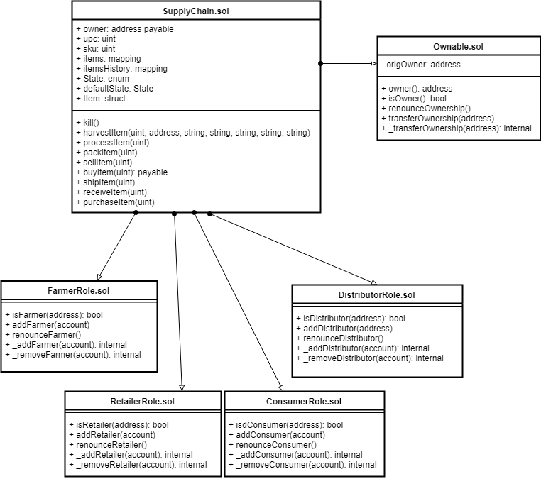

# Supply chain & data auditing

This repository containts an Ethereum DApp that demonstrates a Supply Chain flow between a Seller and Buyer. The user story is similar to any commonly used supply chain process. A Seller can add items to the inventory system stored in the blockchain. A Buyer can purchase such items from the inventory system. Additionally a Seller can mark an item as Shipped, and similarly a Buyer can mark an item as Received.

The DApp User Interface when running should look like...


## Project write-up - UML

### Activity


### Sequence


### State


### Classes (Data Model)


## Project write-up - Libraries
The `Roles` library was used by different access control contracts for easy add and remove in the supply chain 
`truffle-hd-wallet-provider` to sign transactions for addresses.

## IPFS
IPFS is not used in this project

## Dependencies
* Truffle v5.1.23 (core: 5.1.23)
* Solidity v0.5.16 (solc-js)
* Node v8.11.2
* Web3.js v1.2.1
* Truffle-hdwallet-provider ^1.0.17

## Transaction ID and contract address / details
```
Starting migrations...
======================
> Network name:    'rinkeby'
> Network id:      4
> Block gas limit: 10000000 (0x989680)


1_initial_migration.js
======================

   Deploying 'Migrations'
   ----------------------
   > transaction hash:    0x8e77b97ce9efe633ad8acfcdbf6436c0c4734b102f7884cf7a495cadec3a25a3
   > Blocks: 1            Seconds: 14
   > contract address:    0xe4f652B8a5419659acF06A9790BfCF85f807439d
   > block number:        6486907
   > block timestamp:     1589459045
   > account:             0xDe0f853Fd41f3A456F19C7276BbB069F5f02C3Ad
   > balance:             3.138944488
   > gas used:            225237 (0x36fd5)
   > gas price:           10 gwei
   > value sent:          0 ETH
   > total cost:          0.00225237 ETH


   > Saving migration to chain.
   > Saving artifacts
   -------------------------------------
   > Total cost:          0.00225237 ETH


2_deploy_contracts.js
=====================

   Deploying 'FarmerRole'
   ----------------------
   > transaction hash:    0x15554d2808aac9fa275fc32fe38fffd0f08ca02365795f9ba39f8549dfd90fda
   > Blocks: 0            Seconds: 6
   > contract address:    0xbb64FADB946241A376Ac09Bb9267524721c4BCdA
   > block number:        6486909
   > block timestamp:     1589459075
   > account:             0xDe0f853Fd41f3A456F19C7276BbB069F5f02C3Ad
   > balance:             3.135460018
   > gas used:            306084 (0x4aba4)
   > gas price:           10 gwei
   > value sent:          0 ETH
   > total cost:          0.00306084 ETH


   Deploying 'DistributorRole'
   ---------------------------
   > transaction hash:    0xaf13004936d626d67ec065edfa498f6a401e049cbdb514bff662b07f476d7338
   > Blocks: 2            Seconds: 22
   > contract address:    0x509c19099fE064E6038C0148990542773e842337
   > block number:        6486911
   > block timestamp:     1589459105
   > account:             0xDe0f853Fd41f3A456F19C7276BbB069F5f02C3Ad
   > balance:             3.132176158
   > gas used:            328386 (0x502c2)
   > gas price:           10 gwei
   > value sent:          0 ETH
   > total cost:          0.00328386 ETH


   Deploying 'RetailerRole'
   ------------------------
   > transaction hash:    0x43793b93abd6554f1d57b6aa47bb1c511109b59720edffd762557a69da2ce112
   > Blocks: 1            Seconds: 18
   > contract address:    0x8Fc0Ca5b08D1c787952E6560E1C5148Dd314c8B0
   > block number:        6486913
   > block timestamp:     1589459135
   > account:             0xDe0f853Fd41f3A456F19C7276BbB069F5f02C3Ad
   > balance:             3.128892418
   > gas used:            328374 (0x502b6)
   > gas price:           10 gwei
   > value sent:          0 ETH
   > total cost:          0.00328374 ETH


   Deploying 'ConsumerRole'
   ------------------------
   > transaction hash:    0x22af936c04bcc733f2e3a1eb80710a6fe18bd799bb3d1e3d07ec958a62f0efff
   > Blocks: 1            Seconds: 18
   > contract address:    0x7a9b75fb8Fe1795B74c9C49aa4ef3bdE4B39c6DF
   > block number:        6486915
   > block timestamp:     1589459165
   > account:             0xDe0f853Fd41f3A456F19C7276BbB069F5f02C3Ad
   > balance:             3.125608798
   > gas used:            328362 (0x502aa)
   > gas price:           10 gwei
   > value sent:          0 ETH
   > total cost:          0.00328362 ETH


   Deploying 'SupplyChain'
   -----------------------
   > transaction hash:    0xce0c6cbd64abb41285409e5b5e842018eeefc326cc422a2ce4f32a244388281b
   > Blocks: 1            Seconds: 18
   > contract address:    0xA98B0Fd9A80E2295BF075C7c6Ef0593C8AE649d9
   > block number:        6486917
   > block timestamp:     1589459195
   > account:             0xDe0f853Fd41f3A456F19C7276BbB069F5f02C3Ad
   > balance:             3.094090958
   > gas used:            3151784 (0x3017a8)
   > gas price:           10 gwei
   > value sent:          0 ETH

```

## Getting Started

These instructions will get you a copy of the project up and running on your local machine for development and testing purposes. See deployment for notes on how to deploy the project on a live system.

### Prerequisites

Please make sure you've already installed ganache-cli, Truffle and enabled MetaMask extension in your browser.

```
ganache-cli -m "spirit supply whale amount human item harsh scare congress discover talent hamster"
```

### Installing

A step by step series of examples that tell you have to get a development env running

Clone this repository:

```
git clone https://github.com/udacity/nd1309/tree/master/course-5/project-6
```

Change directory to ```project-6``` folder and install all requisite npm packages (as listed in ```package.json```):

```
cd project-6
npm install
```

Launch Ganache:

```
ganache-cli -m "spirit supply whale amount human item harsh scare congress discover talent hamster"
```

Your terminal should look something like this:


In a separate terminal window, Compile smart contracts:

```
truffle compile
```

Your terminal should look something like this:


This will create the smart contract artifacts in folder ```build\contracts```.

Migrate smart contracts to the locally running blockchain, ganache-cli:

```
truffle migrate
```

Your terminal should look something like this:


Test smart contracts:

```
truffle test
```

All 10 tests should pass.


In a separate terminal window, launch the DApp:

```
npm run dev
```

## Built With

* [Ethereum](https://www.ethereum.org/) - Ethereum is a decentralized platform that runs smart contracts
* [IPFS](https://ipfs.io/) - IPFS is the Distributed Web | A peer-to-peer hypermedia protocol
to make the web faster, safer, and more open.
* [Truffle Framework](http://truffleframework.com/) - Truffle is the most popular development framework for Ethereum with a mission to make your life a whole lot easier.


## Authors

See also the list of [contributors](https://github.com/your/project/contributors.md) who participated in this project.

## Acknowledgments

* Solidity
* Ganache-cli
* Truffle
* IPFS
